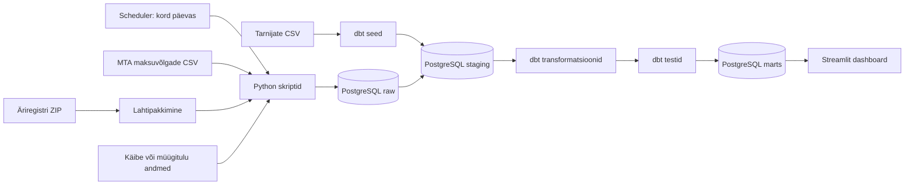

# Arhitektuur

## Äriküsimus

Kuidas saab tootmisettevõte avalike andmete põhjal varakult märgata, kui mõne olulise tarnijaga võib tekkida finants- või tegevusrisk?

## Mõõdikud

1. **Kõrge riskiga tarnijate arv**  
   Loendame tarnijad, kelle arvutatud riskiskoor on kõrge. Esialgne piir on `risk_score >= 70`.

2. **Maksuvõlaga tarnijad**  
   Loendame, mitmel jälgitaval tarnijal on MTA andmetel maksuvõlg, ja summeerime nende maksuvõla eurodes.

3. **Riskiskoori muutus ajas**  
   Võrdleme viimast riskiskoori eelmise andmejooksu tulemusega. Nii on näha, milliste tarnijate olukord on halvenenud.

4. **Käibe või müügitulu signaal**  
   Kasutame käibe või müügitulu andmeid tarnijate eelvalikuks ja hiljem ühe riskikomponendina. Kui tarnija käive/müügitulu on madal või langeb võrreldes varasema perioodiga, võib see riskiskoori tõsta.

## Andmeallikad

| Allikas | Formaat | Muutuvus | Milleks kasutame |
|---|---|---|---|
| MTA maksuvõlglaste nimekiri | CSV | Uueneb igapäevaselt | Kontrollime, kas tarnijal on maksuvõlg |
| Äriregistri lihtandmed | ZIP-fail, mille sees on CSV | Äriregistri avaandmete failid uuenevad üldjuhul kord päevas | Kontrollime ettevõtte nime, registrikoodi, õiguslikku vormi ja staatust |
| MTA tasutud maksud, käive ja töötajate arv | CSV | Kvartaalne | Kasutame käibe ja töötajate arvu signaalina |
| Äriregistri majandusaasta aruannete EMTAK/müügitulu andmed | Avaandmete fail | Perioodiline | Kasutame tarnijakandidaatide valikul EMTAK koodi ja müügitulu järgi |
| Tarnijate nimekiri | CSV seed | Staatiline näidisfail | Määrab, milliseid tarnijaid dashboard jälgib |

Tarnijate nimekiri koostatakse avalike Eesti ettevõtete põhjal. Valiku aluseks on EMTAK kood ja käibe või müügitulu tase. Projekti praegune ulatus on Eesti Äriregistris olevad juriidilised isikud.

## Andmeallikate esmane tehniline kontroll

Sprint 1 ajal kontrollisin põhiandmeallikate ligipääsu ja formaati.

- MTA maksuvõlglaste fail on CSV ja seda saab otse alla laadida.
- Äriregistri lihtandmed tulevad ZIP-failina, mille sees on CSV. Seetõttu peab pipeline'is olema eraldi lahtipakkimise samm.
- Mõlemas põhiandmestikus on olemas registrikoodi väli.
- MTA failis võib olla ka selliseid koode, mis ei ole Eesti Äriregistri 8-kohalised registrikoodid. Need read jäävad raw-kihti alles, aga tarnijate riskiskoor arvutatakse ainult meie tarnijate nimekirjas olevatele Eesti ettevõtetele.
- Käibe/müügitulu allikas vajab veel sprindis 2 täpsemat kontrolli: kas kasutame MTA kvartaalset käivet, Äriregistri aruannete müügitulu või mõlemat.

## Andmevoog

Arenduse ajal saab töövoogu käivitada käsitsi, näiteks `make run-pipeline` käsuga. Lõppversioonis on plaanis lisada lihtne scheduler, mis käivitab põhitöövoo kord päevas. Airflow'd esimeses versioonis ei kasuta liigse keerukuse ja töömahu vältimiseks.

Andmeid ei ole mõtet tõmmata tihemini kui allikas muutub. Seetõttu on põhirütm üks kord päevas. Kvartaalseid käibeandmeid võib kontrollida samas töövoos, aga neid ei pea iga päev sisuliselt ümber arvutama, kui fail ei ole muutunud.

## Andmebaasi kihid

| Kiht | Roll |
|---|---|
| `raw` | Hoiab allikast tulnud andmeid võimalikult muutmata kujul. Siia jõuab ka ZIP-ist lahti pakitud CSV sisu. |
| `staging` | Puhastab veerunimed, andmetüübid ja registrikoodid ühtsele kujule. |
| `intermediate` | Arvutab vahetulemused, näiteks maksuvõla signaali, staatuse signaali ja käibe signaali. |
| `marts` | Hoiab dashboardi jaoks valmis tabeleid, näiteks tarnija viimane riskiseis ja riskiajalugu. |

Selline jaotus teeb veaotsingu lihtsamaks. Kui mart-tabelis on vale tulemus, saab tagasi liikuda staging- või raw-kihti ja vaadata, kas probleem oli allikas, puhastuses või äriloogikas.

## Registrikoodi käsitlus

Kõigis transformeeritud tabelites kasutame välja `registry_code`.

Reeglid:

- registrikood loetakse tekstina, mitte arvuna;
- eemaldatakse alguse ja lõpu tühikud;
- väärtus teisendatakse suurtähtedeks;
- tarnijate tabelis kasutame ainult Eesti Äriregistri 8-kohalisi numbrilisi registrikoode.

MTA failis esinevad mittestandardsed või mitteresidendi koodid jäävad raw-kihti alles. Riskiskoori arvutuses neid praeguses projektis ei kasutata, sest tarnijate nimekiri põhineb Eesti Äriregistri ettevõtetel.

## Riskiskoori algloogika

Riskiskoor on reeglipõhine. See tähendab, et iga riskisignaal annab kindla arvu punkte.

Esialgne loogika:

| Signaal | Mõju skoorile |
|---|---:|
| Tarnijal on maksuvõlg | +40 |
| Maksuvõlg on üle 10 000 euro | +20 |
| Maksuvõlg on üle 100 000 euro | +20 |
| Ettevõte on Äriregistris likvideerimisel | +20 |
| Ettevõte on pankrotis | +30 |
| Tarnija on sisemiselt märgitud kriitiliseks | +10 |
| Käive/müügitulu on madal või langeb oluliselt | täpsustatakse sprindis 2 |

Lõplik riskiskoor piiratakse vahemikku 0–100.

Riskitasemed:

| Tase | Tingimus |
|---|---|
| madal | riskiskoor alla 30 |
| keskmine | riskiskoor 30 kuni 69 |
| kõrge | riskiskoor 70 või rohkem |

Kui tarnija registrikood ei leidu Äriregistri lihtandmetes, käsitleme seda pigem andmekvaliteedi probleemina, mitte automaatse äririskina. Selline juhtum kuvatakse eraldi kontrolli vajava kirjena.

## Andmekvaliteedi kontrollid

Sprindis 2 lisame vähemalt järgmised kontrollid:

1. Tarnija registrikood ei tohi olla tühi.
2. Tarnijate registrikood peab olema tarnijate failis unikaalne.
3. Tarnija registrikood peab vastama Eesti registrikoodi kujule ehk olema 8 numbrit.
4. Maksuvõlg ei tohi olla negatiivne.
5. Riskiskoor peab olema vahemikus 0–100.
6. Riskitase peab olema üks väärtustest: madal, keskmine, kõrge.
7. Laadimisaja väli peab olema täidetud, et oleks teada, millise seisuga andmeid kasutatakse.

## Tööjaotus

Projekt tehakse individuaalselt. Sama inimene täidab mitu rolli.

| Roll | Vastutus | Täitja |
|---|---|---|
| Andmeallika omanik | Kontrollib MTA ja Äriregistri faile ning kirjutab allalaadimise/lahtipakkimise loogika | Jaanus |
| Transformatsioonide omanik | Loob staging-, intermediate- ja mart-tabelid | Jaanus |
| Kvaliteedi omanik | Lisab dbt testid ja dokumenteerib andmekvaliteedi probleemid | Jaanus |
| Dashboardi omanik | Teeb Streamlit dashboardi ja seob selle mõõdikutega | Jaanus |
| Dokumenteerija | Hoiab korras README, arhitektuuri, progressi ja demo kirjelduse | Jaanus |

## Riskid

| Risk | Mõju | Maandus |
|---|---|---|
| Avaliku faili link või struktuur muutub (sh. zip faili sisu) | Pipeline ei saa andmeid alla laadida või lugeda | URL-id pannakse `.env` faili ja lisatakse allika kontrollskript |
| Registrikoodid ei sobitu eri allikates | Tarnija risk võib jääda valesti arvutamata | Registrikoodid standardiseeritakse staging-kihis ja kasutatakse kontrollteste |
| Tarnijate nimekiri on liiga ühekülgne | Dashboard ei näita sisulist väärtust | Valin tarnijaid eri olukordadest: maksuvõlaga, võlata, erineva käibe ja staatusega |
| Käibe/müügitulu andmed uuenevad harvem kui maksuvõlad | Käibesignaal ei pruugi iga päev muutuda | Dashboardil kuvatakse andmete seis ja kasutatakse viimast teadaolevat väärtust |

## Privaatsus ja turve

Projekt kasutab avalikke andmeallikaid ja avalike ettevõtete põhjal koostatud tarnijate näidisnimekirja.

- Andmebaasi kasutaja, paroolid ja URL-id hoitakse lokaalses `.env` failis.
- Repos on ainult `.env.example`.
- Toorandmefaile GitHubi ei lisata; need laaditakse skriptiga alla.
- Dashboard ei kuva isikuandmeid. Fookus on juriidilistel isikutel ja avalikel ettevõtteandmetel.

## Lahtised küsimused

1. Täpsustada, kas käibe/müügitulu signaal tuleb MTA kvartaalsetest käibeandmetest, Äriregistri aruannete müügitulust või mõlemast.
2. Täpsustada käibesignaali punktid riskiskooris pärast andmete esmast analüüsi.
3. Sprindis 2 otsustada, kas scheduler tehakse Docker Compose teenusena või lihtsa cron-lahendusena.
